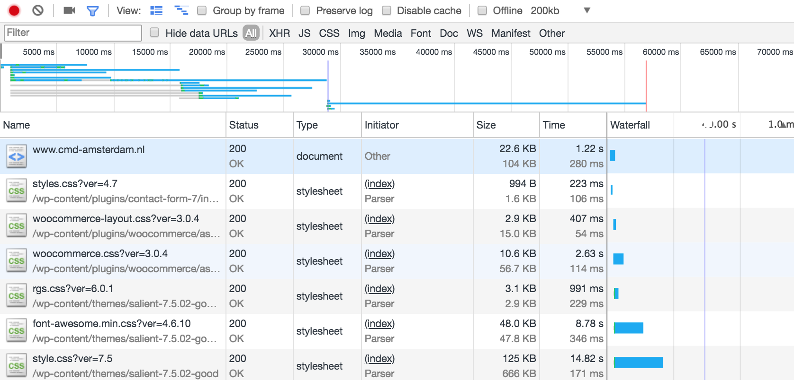
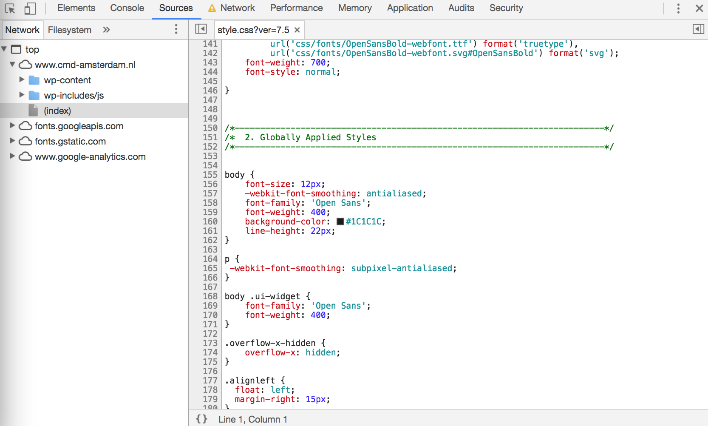
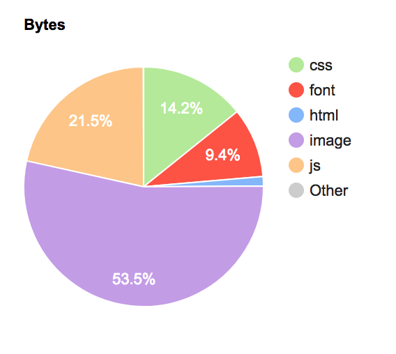

# Performance Checklist

## Table of Contents

*   [Miscellaneous](#miscellaneous)
*   [Audits](#audits)
*   [HTTP optimisation](#http-optimisation)
    *   [HTTP/1](#http1)
    *   [HTTP/2](#http2)
*   [Caching](#caching)
*   [Minification](#minification)
    *   [Images](#images)
    *   [CSS](#css)
    *   [HTML](#html)
    *   [JavaScript](#javascript)
    *   [Fonts](#fonts)
*   [Perceived Performance](#perceived-performance)
*   [Performance](#performance)
    *   [Images](#images-1)
    *   [CSS](#css-1)
    *   [HTML](#html-1)
    *   [JavaScript](#javascript-1)
    *   [Fonts](#fonts-1)
*   [Backend optimisation](#backend-optimisation)

## Miscellaneous

*   Tip: Different profile / user in Chrome without extensions
*   Add some more points here...

## Audits

*   Add some more points here...

## HTTP optimisation

*   Add some more points here...

### HTTP/1

*   Add some more points here...

### HTTP/2

*   Add some more points here...

## Caching

*   Add some more points here...

## Minification

*   Add some more points here...

### Images

*   Add some more points here...

### CSS

*   The css could have some adjustments.
The graph shows that the css is heavy to load.

Check if you dont have double tags and minify it.

[Source](https://www.hanselman.com/blog/TheImportanceAndEaseOfMinifyingYourCSSAndJavaScriptAndOptimizingPNGsForYourBlogOrWebsite.aspx)

### HTML

*   Add some more points here...

### JavaScript

*   Add some more points here...

### Fonts

*   Add some more points here...

## Perceived Performance

*   Add some more points here...

## Performance

*   Add some more points here...

### Images

*   The images are a bit big for performance.
Compress them to get a beter experience.

[source](https://www.webpagetest.org/result/180313_6X_8bfc7081e7066c68c99d8cd696ee3fe9/1/breakdown/)

### CSS

*   Add some more points here...

### HTML

*   Add some more points here...

### JavaScript

*   Add some more points here...

### Fonts

*   Add some more points here...

## Backend optimisation

*   Add some more points here...
